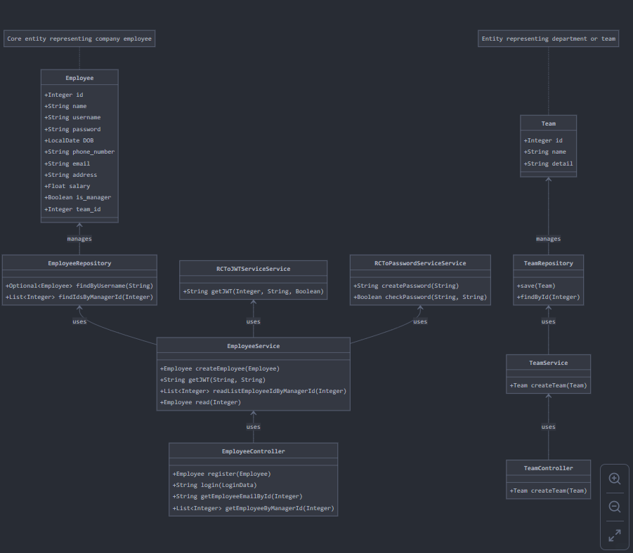
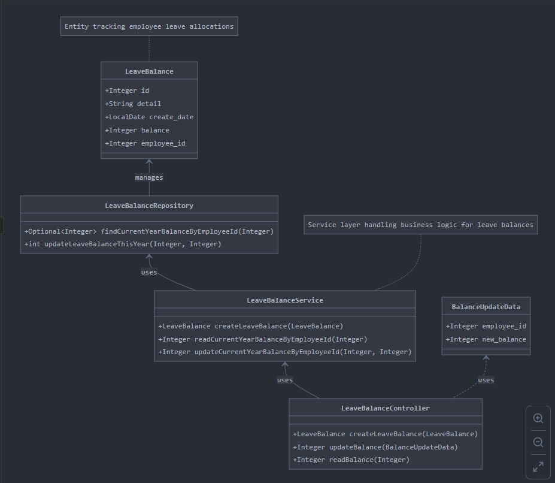
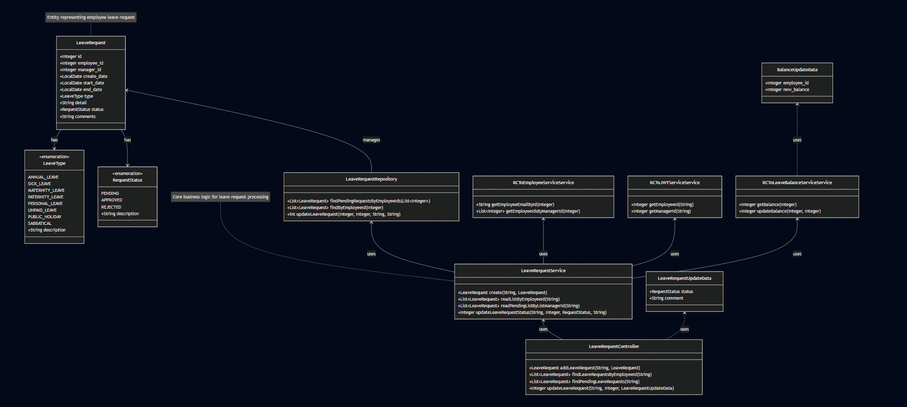
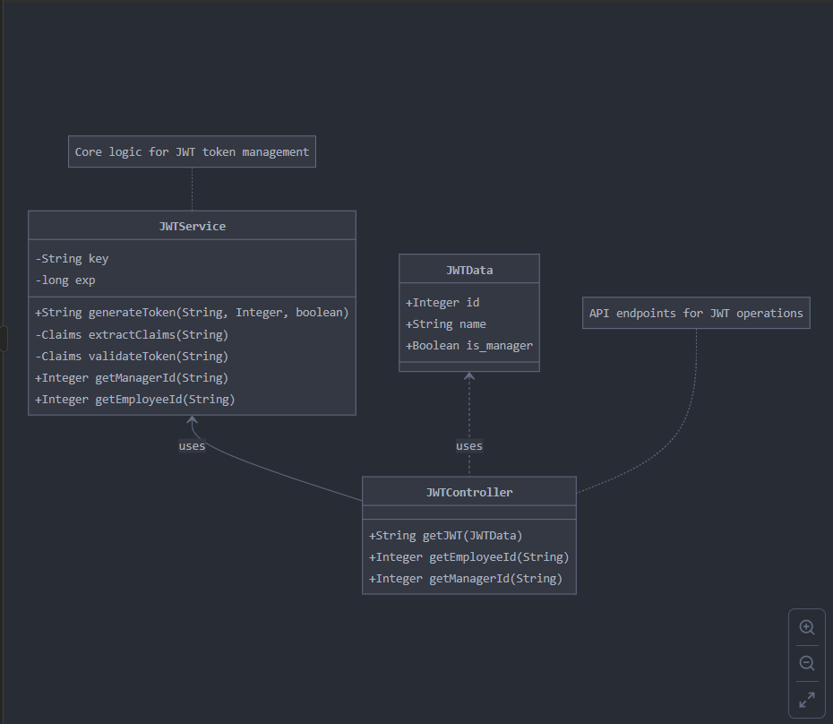
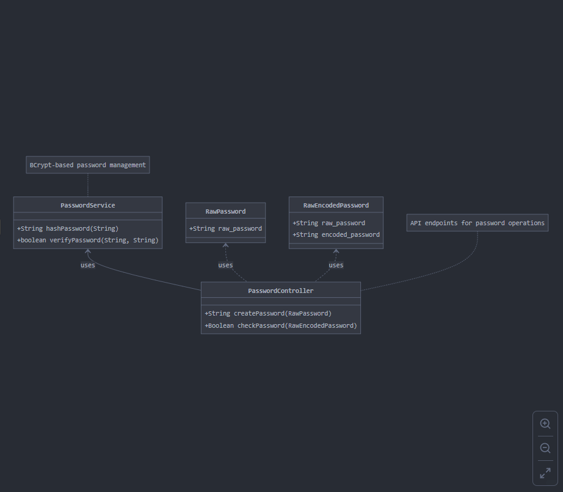
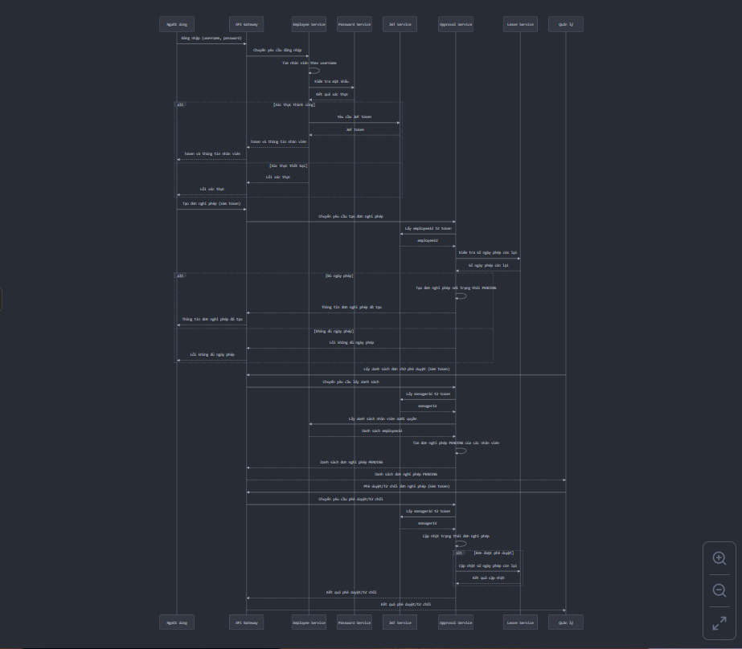

# 📊 Hệ thống Microservices - Phân tích và Thiết kế

Tài liệu này trình bày quá trình **phân tích** và **thiết kế** cho hệ thống microservices quản lý nhân sự và nghỉ phép. Nó giải thích các quyết định kiến trúc và cách tiếp cận của dự án.

---

## 1. 🎯 Mô tả Bài toán

Hệ thống quản lý nhân sự và nghỉ phép được thiết kế để giải quyết nhu cầu quản lý thông tin nhân viên và xử lý quy trình xin nghỉ phép trong doanh nghiệp.

- **Người dùng**:
  - Nhân viên: Cần xem thông tin cá nhân và nộp đơn xin nghỉ phép
  - Quản lý: Phê duyệt đơn xin nghỉ phép của nhân viên
  - Nhân sự: Quản lý thông tin nhân viên và theo dõi ngày nghỉ phép
  
- **Mục tiêu chính**:
  - Quản lý thông tin nhân viên và cấu trúc tổ chức
  - Cung cấp quy trình xin nghỉ phép và phê duyệt tự động
  - Theo dõi số ngày nghỉ phép còn lại của nhân viên
  - Đảm bảo an toàn thông tin và phân quyền hợp lý

- **Dữ liệu được xử lý**:
  - Thông tin cá nhân của nhân viên
  - Cơ cấu tổ chức và nhóm làm việc
  - Đơn xin nghỉ phép và trạng thái
  - Số ngày nghỉ phép còn lại của nhân viên

> Hệ thống cung cấp giải pháp toàn diện để quản lý nhân sự, giúp doanh nghiệp tối ưu hóa quy trình quản lý, tiết kiệm thời gian và tăng sự hài lòng của nhân viên.

---

## 2. 🧩 Các Microservices Đã Xác Định

Hệ thống được chia thành các microservices sau, mỗi service đảm nhận một trách nhiệm riêng biệt:

| Tên Service      | Trách nhiệm                                        | Công nghệ              |
|------------------|----------------------------------------------------|-----------------------|
| Employee Service | Quản lý thông tin nhân viên và cấu trúc tổ chức    | Spring Boot, MySQL    |
| Leave Service    | Quản lý số ngày nghỉ phép còn lại của nhân viên    | Spring Boot, MySQL    |
| Approval Service | Xử lý quy trình đơn xin nghỉ phép và phê duyệt     | Spring Boot, MySQL    |
| JWT Service      | Xử lý xác thực và tạo token                        | Spring Boot           |
| Password Service | Mã hóa và xác minh mật khẩu                        | Spring Boot, BCrypt   |
| Gateway          | Điều hướng yêu cầu tới các service thích hợp       | Spring Cloud Gateway  |

---

## 3. 🔄 Giao tiếp Giữa Các Service

Các microservices trong hệ thống giao tiếp thông qua các cơ chế sau:

- **Gateway ⇄ Tất cả các services**: Gateway sử dụng REST API để định tuyến yêu cầu từ client đến các service phù hợp.

- **Service-to-Service Communication**:
  - Employee Service ⇄ JWT Service (REST): Xác thực và tạo token
  - Employee Service ⇄ Password Service (REST): Mã hóa và xác minh mật khẩu
  - Approval Service ⇄ Employee Service (REST): Lấy thông tin nhân viên và mối quan hệ quản lý
  - Approval Service ⇄ Leave Service (REST): Kiểm tra và cập nhật số ngày nghỉ phép còn lại
  - Approval Service ⇄ JWT Service (REST): Xác thực token và lấy thông tin người dùng

Tất cả giao tiếp đều sử dụng REST API với dữ liệu được truyền tải dưới định dạng JSON. Các yêu cầu xác thực được đảm bảo thông qua JWT token.

---

## 4. 🗂️ Thiết kế Dữ liệu

Mỗi service có cơ sở dữ liệu riêng để đảm bảo tính độc lập cao. Cấu trúc dữ liệu như sau:

### Employee Service:
- **Employee**: Lưu trữ thông tin nhân viên (id, name, username, password, DOB, phone_number, email, address, salary, is_manager, team_id)
- **Team**: Lưu trữ thông tin nhóm làm việc (id, name, detail)

### Leave Service:
- **LeaveBalance**: Lưu trữ thông tin số ngày nghỉ phép (id, detail, create_date, balance, employee_id)

### Approval Service:
- **LeaveRequest**: Lưu trữ đơn xin nghỉ phép (id, employee_id, manager_id, create_date, start_date, end_date, type, detail, status, comments)
- **LeaveType**: Enum (ANNUAL_LEAVE, SICK_LEAVE, MATERNITY_LEAVE, PATERNITY_LEAVE, PERSONAL_LEAVE, UNPAID_LEAVE, PUBLIC_HOLIDAY, SABBATICAL)
- **RequestStatus**: Enum (PENDING, APPROVED, REJECTED)

Mỗi service sử dụng JPA/Hibernate để tương tác với cơ sở dữ liệu MySQL, đảm bảo tính linh hoạt và hiệu quả trong việc quản lý dữ liệu.

---

## 5. 🔐 Các Vấn đề Bảo mật

Hệ thống áp dụng nhiều lớp bảo mật để đảm bảo an toàn thông tin:

- **JWT Authentication**: Sử dụng JWT token để xác thực người dùng và quản lý phiên làm việc
- **Password Hashing**: Mật khẩu được mã hóa bằng BCrypt trước khi lưu trữ
- **API Gateway Security**: Tất cả yêu cầu đều đi qua gateway để kiểm tra xác thực và phân quyền
- **Fine-grained Access Control**: Phân quyền chi tiết dựa trên vai trò (nhân viên/quản lý)
- **Service Isolation**: Mỗi service chỉ có quyền truy cập vào dữ liệu của riêng mình
- **HTTPS Communication**: Giao tiếp được mã hóa thông qua HTTPS

Với các lớp bảo mật này, hệ thống đảm bảo thông tin nhân viên và dữ liệu doanh nghiệp được bảo vệ an toàn.

---

## 6. 📦 Kế hoạch Triển khai

Hệ thống được triển khai sử dụng Docker và Docker Compose:

- **Containerization**: Mỗi service được đóng gói trong một container Docker riêng biệt
- **Docker Compose**: Quản lý và điều phối các container, kết nối mạng, và cấu hình môi trường
- **Environment Variables**: Cấu hình được lưu trong file `.env` để dễ dàng điều chỉnh
- **Service Discovery**: Các service giao tiếp thông qua tên container trong mạng Docker
- **Volume Persistence**: Dữ liệu MySQL được lưu trữ bền vững thông qua Docker volumes
- **Single Command Deployment**: Toàn bộ hệ thống có thể được khởi chạy với lệnh `docker-compose up`

Cách tiếp cận này đảm bảo triển khai nhất quán, dễ dàng mở rộng và đơn giản hóa quy trình phát triển.

---

## 7. 🎨 Biểu đồ Kiến trúc

### Kiến trúc Tổng thể

Dưới đây là biểu đồ kiến trúc tổng thể của hệ thống:

+------------+           +-----------------+
|            |  ------->  | JWT Service    |
|            |            +-----------------+
|            |           
|            |           +-----------------+
|            |  ------->  | Password Service|
|  Gateway   |            +-----------------+
|            |           
|            |           +------------------+
|            |  ------->  | Employee Service |
|            |            +------------------+
|            |                     |
|            |                     v
|            |           +------------------+
|            |  ------->  | Leave Service    |
|            |            +------------------+
|            |                     ^
|            |                     |
|            |           +------------------+
|            |  ------->  | Approval Service |
+------------+            +------------------+

### Biểu đồ Lớp của Các Service

#### Employee Service

#### Leave Service

#### Approval Service

#### JWT Service

#### Password Service

#### Gateway Service

## 8. 🔄 Quy trình Nghiệp vụ Chính

### Quy trình Xin Nghỉ phép và Phê duyệt

Biểu đồ tuần tự dưới đây mô tả quy trình xin nghỉ phép và phê duyệt trong hệ thống:

Quy trình bao gồm các bước chính:
1. Nhân viên gửi đơn xin nghỉ phép
2. Hệ thống kiểm tra số ngày phép còn lại
3. Quản lý xem xét và phê duyệt/từ chối đơn
4. Cập nhật số ngày phép còn lại nếu đơn được phê duyệt

Kiến trúc microservices được chọn cho hệ thống quản lý nhân sự và nghỉ phép là phù hợp vì nhiều lý do:

1. **Khả năng mở rộng**: Mỗi service có thể được mở rộng độc lập dựa trên nhu cầu, ví dụ như Approval Service có thể cần nhiều tài nguyên hơn trong mùa cao điểm nghỉ phép.

2. **Tính linh hoạt**: Các team phát triển có thể làm việc độc lập trên từng service mà không ảnh hưởng đến nhau, tăng tốc độ phát triển.

3. **Khả năng phục hồi**: Nếu một service gặp sự cố, các service khác vẫn có thể hoạt động, giảm thiểu tác động đến người dùng.

4. **Bảo mật tốt hơn**: Phân chia rõ ràng giữa các service giúp thực hiện các chính sách bảo mật chi tiết và giới hạn phạm vi ảnh hưởng của các lỗ hổng tiềm ẩn.

5. **Dễ dàng cập nhật và bảo trì**: Các service có thể được cập nhật hoặc thay thế mà không ảnh hưởng đến toàn bộ hệ thống.

Trong tương lai, hệ thống có thể được mở rộng thêm với các service khác như Notification Service (gửi thông báo), Reporting Service (báo cáo), hoặc tích hợp với các hệ thống HR khác.

## Tác giả

Tài liệu này được tạo bởi Le Nguyen Hai Dang