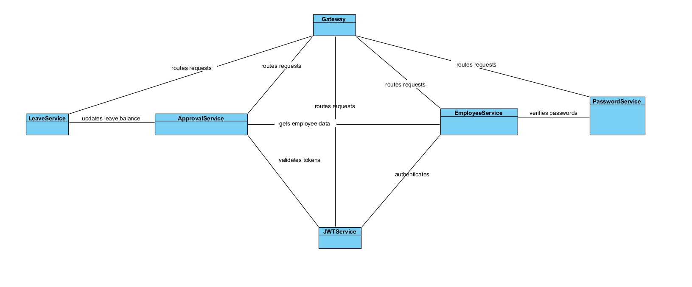

# Kiến trúc Hệ thống

## Tổng quan
Hệ thống quản lý nhân sự và nghỉ phép là một ứng dụng doanh nghiệp được xây dựng trên nền tảng microservices. Mục đích chính của hệ thống là quản lý thông tin nhân viên, xử lý quy trình xin nghỉ phép, và theo dõi số ngày nghỉ phép còn lại của nhân viên một cách hiệu quả.

Kiến trúc microservices được lựa chọn để tăng tính mô-đun, khả năng mở rộng và bảo trì, cũng như cho phép các team phát triển làm việc độc lập trên các thành phần khác nhau của hệ thống.

## Thành phần Hệ thống

- **Employee Service**: Dịch vụ này quản lý thông tin nhân viên và cấu trúc tổ chức. Nó lưu trữ dữ liệu nhân viên như tên, thông tin liên hệ, phòng ban, và mối quan hệ quản lý. Dịch vụ này cũng xử lý chức năng đăng nhập và xác thực thông qua tích hợp với JWT Service và Password Service.

- **Leave Service**: Dịch vụ này quản lý số ngày nghỉ phép còn lại của nhân viên. Nó theo dõi số ngày phép được cấp và số ngày đã sử dụng, cũng như cung cấp API để cập nhật số dư ngày phép khi đơn nghỉ phép được phê duyệt.

- **Approval Service**: Dịch vụ này xử lý quy trình xin nghỉ phép và phê duyệt. Nó quản lý việc tạo đơn xin nghỉ phép, kiểm tra tính hợp lệ, định tuyến đơn đến quản lý thích hợp, và xử lý hành động phê duyệt/từ chối.

- **JWT Service**: Dịch vụ này chịu trách nhiệm tạo và xác thực JWT token cho xác thực và phân quyền. Nó cung cấp các endpoint để tạo token mới và xác thực token hiện có.

- **Password Service**: Dịch vụ này xử lý mã hóa mật khẩu và xác minh. Nó sử dụng BCrypt để bảo mật mật khẩu và cung cấp API để kiểm tra mật khẩu trong quá trình đăng nhập.

- **API Gateway**: Gateway đóng vai trò là điểm vào duy nhất cho tất cả các yêu cầu từ client. Nó định tuyến yêu cầu đến các service thích hợp, xử lý xác thực, và đảm bảo bảo mật.

## Giao tiếp

Các service trong hệ thống giao tiếp chủ yếu thông qua RESTful APIs:

- **Giao tiếp đồng bộ**: Các service gọi trực tiếp API của nhau khi cần dữ liệu hoặc chức năng từ service khác:
  - Employee Service → JWT Service: Tạo token JWT khi người dùng đăng nhập
  - Employee Service → Password Service: Xác minh mật khẩu trong quá trình đăng nhập
  - Approval Service → Employee Service: Lấy thông tin nhân viên và quan hệ quản lý
  - Approval Service → Leave Service: Kiểm tra và cập nhật số ngày phép còn lại
  - Approval Service → JWT Service: Xác thực token và lấy ID nhân viên/quản lý

- **Mạng nội bộ**: Các service giao tiếp qua mạng nội bộ Docker Compose sử dụng tên service làm hostname:
  - employee-service:8080
  - leave-service:8080
  - approval-service:8080
  - jwt-service:8080
  - password-service:8080

Tất cả API calls sử dụng định dạng JSON cho request và response body, đảm bảo khả năng tương tác và dễ sử dụng.

## Luồng Dữ liệu

### Đăng nhập và Xác thực
1. Client gửi thông tin đăng nhập (username, password) đến Gateway
2. Gateway định tuyến yêu cầu đến Employee Service
3. Employee Service tìm kiếm nhân viên theo username
4. Employee Service gọi Password Service để xác minh mật khẩu
5. Nếu xác thực thành công, Employee Service gọi JWT Service để tạo token
6. Token JWT được trả về cho client thông qua Gateway

### Quy trình Xin Nghỉ phép
1. Client gửi đơn xin nghỉ phép (kèm token JWT) đến Gateway
2. Gateway xác thực token và định tuyến yêu cầu đến Approval Service
3. Approval Service gọi JWT Service để lấy employee_id từ token
4. Approval Service gọi Leave Service để kiểm tra số ngày phép còn lại
5. Approval Service tạo một đơn nghỉ phép mới với trạng thái PENDING
6. Đơn nghỉ phép được lưu vào cơ sở dữ liệu của Approval Service

### Quy trình Phê duyệt Đơn Nghỉ phép
1. Quản lý gửi yêu cầu lấy danh sách đơn chờ phê duyệt đến Gateway
2. Gateway định tuyến yêu cầu đến Approval Service
3. Approval Service gọi JWT Service để lấy manager_id từ token
4. Approval Service gọi Employee Service để lấy danh sách nhân viên dưới quyền
5. Approval Service trả về danh sách đơn cần phê duyệt
6. Khi quản lý phê duyệt đơn, Approval Service cập nhật trạng thái đơn
7. Nếu đơn được phê duyệt, Approval Service gọi Leave Service để cập nhật số ngày phép còn lại

## Biểu đồ

## Khả năng Mở rộng & Khả năng Chịu Lỗi

### Khả năng Mở rộng
- **Mở rộng theo chiều ngang**: Mỗi service có thể được triển khai trên nhiều instance để xử lý tải cao hơn.
- **Mở rộng độc lập**: Các service có thể được mở rộng độc lập dựa trên nhu cầu cụ thể. Ví dụ, trong mùa cao điểm nghỉ phép, Approval Service có thể cần nhiều tài nguyên hơn.
- **Cơ sở dữ liệu độc lập**: Mỗi service có cơ sở dữ liệu riêng, cho phép mở rộng lưu trữ dữ liệu độc lập.

### Khả năng Chịu Lỗi
- **Cô lập lỗi**: Nếu một service gặp sự cố, các service khác vẫn có thể hoạt động, hạn chế tác động của lỗi.
- **Circuit Breaker**: Có thể triển khai mẫu thiết kế circuit breaker để xử lý lỗi khi giao tiếp giữa các service.
- **Cơ chế thử lại**: Các yêu cầu quan trọng có thể được thử lại nếu gặp lỗi tạm thời.
- **Phát hiện lỗi**: Hệ thống giám sát có thể được thiết lập để phát hiện và cảnh báo khi service gặp vấn đề.

Kiến trúc microservices cho phép hệ thống duy trì tính khả dụng cao ngay cả khi một số thành phần gặp sự cố, đồng thời cung cấp khả năng mở rộng hiệu quả để đáp ứng nhu cầu không ngừng tăng.